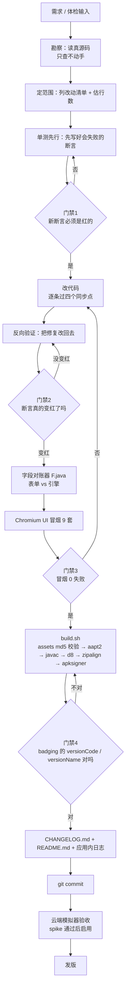

# LazyTap 开发路线图

> 本文件是本项目**唯一权威的开发计划**。包含：现状盘点、开发流程图、v2.4.0 实施方案、v2.5→v3.0 路线图、版本前瞻、体积预算、测试策略、风险清单、发版 checklist。
>
> 基线快照：**v2.3.0**（commit `5e79731`，版本码 15，APK 136,600 B）。
>
> **最近更新**：v2.4.0 已交付（节点查找增强），详见 [CHANGELOG v2.4.0](../CHANGELOG.md#v2402026-10-01-当前版本)。当前版本 v2.4.0 / 版本码 16 / 140,696 B。

---

## 〇、为什么要有这份文件

一句话：**此前所有版本规划都只活在我们的对话里，仓库里一个字都没有。**

具体说，我们反复引用过这样一份差距清单——「缺 OCR、缺暂停/恢复、缺多任务并行、desc/正则、子脚本传参」。把全仓库文件和 17 个 commit 翻遍，**这份清单在仓库中不存在**，`docs/` 目录下只有截图，没有任何 md 文档。这意味着一旦对话上下文中断，这些判断就全部丢失，下次要从零重新勘察一遍。

所以这份文档的第一价值不是「规划未来」，而是「把已经做出的判断固化下来」。以后每个版本的计划都**从这里出发、改在这里**，不再靠记忆。

---

## 一、现状与目标

### 1.1 代码地图

**Java（23 个文件，6402 行）** —— `src/com/lazytap/clicker/`

| 文件 | 行数 | 职责 | 能否纯 JDK 单测 |
|---|---:|---|---|
| ScriptRunner.java | 1346 | 动作执行引擎、条件判断、JS 驱动 | ✗ 依赖 SDK |
| FloatService.java | 1013 | 悬浮球 / 运行浮层 / 脚本面板 | ✗ |
| TapService.java | 789 | 无障碍服务主体、节点查找、手势 | ✗ |
| JsApi.java | 557 | JS 原生桥 | ✗ |
| Expr.java | 363 | 表达式求值 | ✓ |
| JsEngine.java | 346 | WebView 里跑 JS 的封装 | ✗ |
| Share.java | 289 | 分享码编解码 | ✓ |
| Vars.java | 219 | 变量系统（含 v2.3.0 的 `hit.*`） | ✓ |
| Trigger.java | 197 | 触发条件（时间/通知/手势） | ✗ |
| Img.java | 186 | 找色 / 找图 / 比色 | ✗ |
| Capture.java | 185 | 截屏 | ✗ |
| ScriptStore.java | 167 | 脚本持久化 | ✗ |
| MainActivity.java | 131 | 主界面容器 | ✗ |
| Prefs.java | 110 | 配置 | ✗ |
| CaptureService.java | 97 | MediaProjection 服务 | ✗ |
| LogLine.java | 87 | 运行日志行 | ✓ |
| **Timing.java** | **80** | 时间计算（v2.3.0 抽出） | ✓ |
| TplStore.java | 73 | 模板库 | ✗ |
| QuickTile.java | 50 | 快捷磁贴 | ✗ |
| HotKey.java | 41 | 音量键判定 | ✓ |
| Bus.java / BootReceiver.java / TriggerReceiver.java | 28 / 25 / 23 | 事件总线 / 开机 / 触发器 | ✗ |

**前端（3046 行）** —— `assets/www/`：app.js 2351 / style.css 381 / runner.js 276 / index.html 30 / jsrunner.html 8。
动作类型 **TYPES 21 种**，条件类型 **CTYPES 8 种**。

**测试**：纯 JDK 单测 **10 类 339 项**（`tools/test/run-tests.sh`）；headless Chromium UI 冒烟 **9 套 141 张截图**（`tools/smoke/`）。CI 两 job：`test` → `build`。

### 1.2 对标自动精灵：差距表

自动精灵 26.5.0 是 44 MB 的商业产品（AndResGuard 混淆 + 360 加固 `assets/libjiagu.so`，带 QuickJS 与 ML Kit OCR）。逐条对照：

| 能力 | 自动精灵 | LazyTap 现状 | 结论 |
|---|---|---|---|
| 节点查找 id / viewId | 有 | **无**。`getViewIdResourceName()` 因未设 `FLAG_REPORT_VIEW_IDS` 恒返回 null | **v2.4.0 补** |
| 节点查找 正则 | 有 | 无，只有 `contains` 子串 | **v2.4.0 补** |
| 节点查找 desc | 有 | **引擎已支持**（TapService.java:379 `getContentDescription()`），只是表单没入口 | v2.4.0 顺带补入口 |
| 暂停 / 恢复 | 有 | 无，只有跑 / 停（ScriptRunner.java:225 `stop()`） | **v2.5.0** |
| 音量键三态 | 有 | 只有一态（HotKey.java:27 `wantStop`） | v2.5.0 |
| 多任务并行 | 有 | 无，`ScriptRunner.get()` **单例且被设计成互斥**（ScriptRunner.java:359 注释「它们本来就没法并行」） | **v3.0.0** |
| 子脚本传参 | 有 | 无，JsApi 与 runner.js 均无 args 入口 | **v2.6.0** |
| JS 模式完整性 | QuickJS 全量 | 受限桥 + 注入包装（不用 QuickJS 的三条理由见 CHANGELOG v1.7.0） | v2.6.0 |
| OCR 文字识别 | ML Kit / 端上模型 | **无，且零依赖下做不了真 OCR** | 见 1.3 |
| 脚本市场 | 有（服务端） | 分享码（纯离线） | 不追 |
| 包体积 | 44 MB | 136 KB | **刻意保持，是优势不是差距** |
| 加固 / 混淆 | 360 加固 + AndResGuard | 无 | 不追 |

### 1.3 关于 OCR：明确不做

真 OCR 只有两条路：打包 ≥10 MB 的中文模型，或依赖 ML Kit（Google Play 服务 + 第三方库）。两条都与本项目立项目标「**零第三方依赖、控体积**」正面冲突，所以：

> **不做真 OCR。**

现实替代路线是「**按 viewId / desc 找节点 + `getText()` 取字**」，这能覆盖自动化脚本约 90% 的「找文字」需求。剩下 10%（游戏画面、无节点画布）在零依赖约束下本来就无解。

这条写死在这里，避免以后反复纠结。如果真有一天要做，也只能做「自截字模 + 模板匹配」的**伪 OCR**，仍然零依赖——但那排在 v3.0 之后，且优先级最低。

### 1.4 立项目标（不因迭代而漂移）

1. **零第三方依赖**，整条构建链只用本地 Android SDK + JDK。
2. **小体积**（红线见 §6）。
3. **优先 JS**，但图形化动作编辑同样是一等公民。
4. **一个版本一个版本迭代**，每版以上一版为基础增量更新，不做一次性大包。

---

## 二、开发流程图

### 图 A：单版本迭代主流程

每个门禁的意义：

| 门禁 | 卡什么 | 为什么要卡 |
|---|---|---|
| 门禁 1 | 新断言必须先红 | 防止写出「永远绿的假测试」——v2.3.0 就抓到过一次：冒烟测试数据本身写错，等于把 bug 测成绿的 |
| 门禁 2 | 反向验证要真变红 | 证明这版改的东西真的被测试覆盖到了，改回去测试无感 = 白改 |
| 门禁 3 | 冒烟 0 失败 | 前端表单与引擎字段不一致是大概率事故（见 §9） |
| 门禁 4 | badging 版本号 | 构建链是手工的，版本号写错不会报错，只会让用户装错版本 |

### 图 B：版本演进与依赖

**v2.7.0 为什么不能跳过**：v3.0.0 的难点从来不是「并发」本身，而是全仓 **53 处 `ScriptRunner.get()`**（分布在 9 个文件：JsEngine 16 / JsApi 12 / FloatService 9 / TapService 9 / QuickTile 3 / MainActivity 1 / Trigger 1 / CaptureService 1 / Capture 1）。v2.7.0 先把「一次运行」的边界——runId、日志、状态广播、浮层状态条——切干净，v3.0.0 才只需要改「拿哪个实例」。跳过 v2.7.0 直上 v3.0.0 = 一次改 400 行且无法分步验证。

---

## 三、v2.4.0 实施方案：节点查找增强

**主题**：让「找文字/找节点」支持 **viewId + 正则 + desc**，对齐自动精灵的多条件筛选。
**决策**：id 与 text 同时填时取 **「且」**（全部满足才算命中），对齐自动精灵语义。

### 3.1 改动清单

**① 新增 `src/com/lazytap/clicker/NodeMatch.java`（零 Android 依赖，约 90 行）**

| 方法 | 行为 |
|---|---|
| `normId(String)` | `com.xxx:id/foo` → `foo`；纯 id 原样；null / 空串统一 |
| `idHit(nodeId, q)` | 规范化后 equals |
| `plain(nodeText, q, contains)` | contains ? 子串 : 全等 |
| `regex(nodeText, pat)` | LRU 缓存 `Pattern`（上限 32）；**非法正则返回 false，不抛异常** |
| `hit(q, id, text, desc)` | 统一入口，按「且」组合；q 里没填的条件视为不约束 |
| `empty(q)` | 三个条件全空 → 返回 true（不筛选），保证老脚本行为不变 |

> 非法正则必须回落 false 而不是抛异常：抛异常会崩掉整个动作，且日志里看不出是正则写错——这正是 v2.3.0 扫的那类静默失效。

**② `TapService.java:105` `onServiceConnected()` 追加 `FLAG_REPORT_VIEW_IDS`**

这是本版**头号静默失效**：不加这个 flag，`getViewIdResourceName()` 恒返回 null，**不报错、不崩溃、就是永远找不到**。和 v2.2.0 踩过的 `canRequestFilterKeyEvents` 是同一类坑。

**③ `TapService.java:359` 加 `findNode(NodeMatch q, ...)` 重载，旧签名转发过去**

旧签名 `findNode(String text, boolean contains, boolean clickableOnly, int nth)` 保留并转发到新重载，
所以「遍历树 + obtain/recycle + depth 截断」这套完全不用重写，只把匹配体换成 `q.matches(...)`。

四个调用点全部在 ScriptRunner.java。注意这里有一处**规划时的自相矛盾**，动手时才发现，记下来防止再犯：

> 原稿这里写的是「四个调用点**零改动**」，但它与下面的 ④ 直接冲突——
> `id`/`desc`/`re` 必须由 ScriptRunner 用 `a.optString(...)` **显式读出来**，
> 否则 `F.java` 的 `reads()` 扫不到，会当成「表单能填、引擎不读」报 `[find.id]`。
> **所以四个调用点各加了 3~4 行读取代码**，以 ④ 为准。

- `:598` — find 动作
- `:636` — waitFind 的轮询 lambda
- `:699` — execIf
- `:827` — oneCond 的 text 分支

**④ ScriptRunner.java 里 `id` / `regex` / `desc` 的 opt 读取必须留在 ScriptRunner 内**

不能下沉到 NodeMatch。原因：`tools/test/F.java` 的字段对账只扫 ScriptRunner 源码，读字段的代码一旦移出去，对账器会误报「引擎不读这个字段」——这是 v2.3.0 花了一整轮才摸清的教训。

**⑤ `assets/www/app.js` 三处表单加 `id` / `regex` / `desc` 入口**

find 动作表单、waitFind（与 find 共用）、if/条件里的 text 分支。

**⑥ 新增 `tools/test/N.java`（约 40 断言）**

normId 四种输入形态、contains vs 全等、非法正则不抛异常、LRU 上限、「且」语义四组合、空查询向后兼容。

**⑦ 新增 `tools/smoke/v24.js`**

三处表单能看到新字段、能存能读。

### 3.2 反向验证四步（做完必须跑，缺一步不算完）

| 步骤 | 操作 | 预期 |
|---|---|---|
| ① | 去掉 `FLAG_REPORT_VIEW_IDS` | id 恒空的断言变红 |
| ② | 把「且」改回「或」 | N.java 挂 |
| ③ | 表单只加字段、引擎不读 | F.java 报 `[dead]` |
| ④ | 引擎读了、表单没入口 | F.java 报 `[hidden]` |

### 3.3 规模

约 **140 行**，涉及 4 个文件 + 1 个新类；体积 136.6 KB → 约 138 KB。

---

## 四、路线图：v2.5 → v3.0

| 版本 | 主题 | 核心改动 | 改动量 | 验收标准 | 依赖 |
|---|---|---|---|---|---|
| **v2.4.0** ✅ 已交付 | 节点查找增强 | NodeMatch + FLAG_REPORT_VIEW_IDS + 三处表单 + clickable 对齐条件侧 | **实到约 160 行** | N.java **52** 断言 + v24 冒烟 7 张 + 反向验证 6 步 | v2.3.0 |
| **v2.5.0** | 三态运行（暂停 / 恢复） | 抽 `RunState`（IDLE / RUNNING / PAUSED / STOPPING）、音量键三态、浮层暂停按钮、断点续跑 | 约 130 行 / 6 文件 | 暂停后恢复**从同一动作续跑**，不从头开始 | v2.4.0 |
| **v2.6.0** | JS 模式补齐 + 子脚本传参 | JsApi 补全（节点 / 坐标 / 等待系列）；`runSub` 支持 `args` 传参与返回值 | 约 140 行 / 4-5 文件 | 子脚本能收参、能回值给父脚本 | v2.5.0 |
| **v2.7.0** | 多任务基建（**还不并行**） | 日志加 `runId`、状态多播、status 聚合、浮层支持多条状态条 | 约 250 行 | 两脚本交替跑不串日志、状态各记各的 | v2.6.0 |
| **v3.0.0** | **多任务并行** | ScriptRunner 单例改实例池，解掉 53 处 `get()` | 约 400+ 行 / 8 文件 | 两脚本真并发互不干扰 | **v2.7.0 硬前置** |

### 关于 RunState 的时机（已决策）

`RunState` **不在 v2.4.0 预抽空类，v2.5.0 一次做完**。两条理由：

1. v2.4.0 保持单一主题，不掺与本版无关的改动——每掺一个「顺手做」，就多一处没被反向验证覆盖的地方。
2. RunState 的字段形状（暂停点在哪、恢复时要带什么）要等 v2.4.0 把日志与浮层摸清楚再定。提前抽容易抽错形状，v2.5.0 还得返工。

---

## 五、版本前瞻（v3.0 之后）

只做方向性说明，不排期、不承诺：

- **多任务并行深化**：分组内并行、脚本间互斥锁、共享变量表。
- **OCR 的现实替代**：坚持不做真 OCR（§1.3）；若确有需求，走「自截字模 + 模板匹配」的伪 OCR，仍然零依赖。
- **插件化 / 市场客户端**：分享码能力已具备，服务端市场不做——离线是卖点。
- **明确不追**：加固、混淆、44 MB 体量、商业化。

> 「不做什么」和「做什么」一样重要。这条清单存在的意义，是防止某个版本突然冒出「要不我们也加个 OCR / 加个市场」的冲动。

---

## 六、体积预算与红线

| 版本 | APK 体积 | 增量 |
|---|---:|---:|
| v2.3.0 基线 | 136,600 B | — |
| **v2.4.0（已交付）** | **140,696 B** | **+4,096** |
| v2.5.0 | 约 145 KB | +4 |
| v2.6.0 | 约 149 KB | +4 |
| v2.7.0 | 约 153 KB | +4 |
| v3.0.0 | ≤ 160 KB | +6 |

**红线**：dex ≤ 200 KB、APK ≤ 200 KB。

超了就拆功能，**不许靠砍测试或砍日志腾地方**。自动精灵 44 MB 对我们 156 KB 不是差距，是刻意选择——这是本产品的核心辨识度之一。

---

## 七、测试策略矩阵

没有 KVM、没有真机，所以验证手段要分层，每层明确「验不了什么」：

| 手段 | 能验什么 | 验不了什么 | 现状 |
|---|---|---|---|
| **纯 JDK 单测**（剥 package 编真源码） | 零 Android 依赖类的逻辑：Expr / Vars / Share / LogLine / HotKey / Timing / **NodeMatch** | ScriptRunner / FloatService / TapService 等依赖 SDK 的类 | 10 类 339 项 |
| **headless Chromium 冒烟**（puppeteer + `mock.js` 假原生桥） | 前端表单、存读、UI 流程、字段入口有没有 | 真实无障碍、真实点击、真实截屏 | 9 套 141 张 |
| **GitHub Actions 云端模拟器**（spike 通过后启用） | 真机安装、无障碍服务开启、真实节点树、真点击 | **MediaProjection 截屏授权无法静默授权**（系统弹窗），只能 uiautomator 点或退 `screencap` | 未启用 |
| **只能真机人工** | 悬浮窗权限交互、各厂商 ROM 差异、长时间稳定性 | — | **八个版本从未做过** |

第三行是下一阶段要补的最大缺口，方案见 §8 风险 5。

---

## 八、风险清单

| # | 风险 | 说明与对策 |
|---|---|---|
| 1 | **`FLAG_REPORT_VIEW_IDS` 不加则 id 恒 null** | v2.4.0 头号静默失效。不报错、不崩溃，只是永远找不到。必须在代码里写注释并进单测 |
| 2 | **非法正则** | 用户在表单里填 `[` 之类，必须回落 false，不能抛异常崩掉动作 |
| 3 | **老脚本兼容** | 升级后老脚本的 find 没填 id / regex，行为必须完全不变（`empty()` 返回 true = 不筛选） |
| 4 | **org.json 形态陷阱** | 对布尔求 `optInt`、对数字求 `optBoolean` 都会抛异常并回落默认值 → 界面存布尔、引擎按数字读会静默失效。一律用 `on(a, k, def)` 三形态兼容读法，新代码禁止直接用 `optBoolean` / `optInt` |
| 5 | **真机从未验证** | 八个版本零真机验证，是本项目最大已知风险。对策见 §8.1 |
| 6 | **MediaProjection 无法静默授权** | 已确认做不到（系统弹窗拦截不了）。**不写进任何承诺**，只标「待真机确认」 |
| 7 | **v3.0.0 的 53 处单例改造** | 靠 v2.7.0 提前拆边界，否则是不可控的一次性大改 |

### 8.1 云端模拟器验收方案（spike 先行，不阻塞发版）

单独写一个最小 `.github/workflows/verify.yml`，只验两件事，跑通再往正式流程接：

1. `ubuntu-latest` 上 `/dev/kvm` 是否可用（先写 `99-kvm4all.rules`：`KERNEL=="kvm", MODE="0666", OPTIONS+="static_node=kvm"`，配合 `reactivecircus/android-emulator-runner@v2`）。
2. 能否用 `adb shell settings put secure enabled_accessibility_services com.lazytap.clicker/.TapService` + `accessibility_enabled 1` 静默开启无障碍服务。

**选 ubuntu 不选 macOS**：macOS runner 只有 HAXM 没有 KVM，且分钟数按 10 倍计费。

**不承诺项**：MediaProjection 静默授权做不到，只标「待真机确认」。

---

## 九、发版 checklist：每版必改的四个同步点

漏任何一条，都会出现「功能做了但用户看不到」或「版本号对不上」：

- [ ] `tools/test/F.java` 里硬编码的版本号（当前 `"2.3.0"`，约 150 行）改成新版本
- [ ] `assets/www/app.js` 应用内更新日志数组的**第一条**改成新版本（这条曾停更在 v1.4.0，连续七个版本用户看不到更新日志，v2.3.0 才补齐）
- [ ] `CHANGELOG.md` 加新版本长条目；**「体积对比」表当前停在 v1.8.0**，要一并更新
- [ ] `README.md` 编译示例里的版本号（当前写 `./build.sh 2.2.0 14`，约 218 行）改成新版本

### 9.1 为什么会有这四个同步点

因为整个项目**没有构建脚本自动生成版本号**：版本名散落在 Java 测试、前端日志、CHANGELOG、README 四处，靠手工同步。这是手工构建链的代价，也是过去踩过坑的地方（应用内日志停更七版、体积表停更五版）。

长远看应该用脚本统一注入，但在「零依赖 + 手工链」的约束下，先靠 checklist 兜住。

---

## 十、决策记录

| 决策 | 结论 | 理由 |
|---|---|---|
| v2.4.0 匹配语义 | **「且」**（全部满足） | 对齐自动精灵的多条件筛选语义，后期加 desc / regex 是同一套逻辑，可推理 |
| RunState 抽取时机 | **v2.5.0 一次做完** | v2.4 保持单一主题；字段形状要等日志/浮层摸清再定，提前抽易返工 |
| 多任务并行 | **排到 v3.0.0** | 需先过 v2.7.0 基建，否则 53 处单例一次炸开 |
| OCR | **不做真 OCR** | 与零依赖 / 控体积正面冲突；用 viewId + desc + getText 替代 |
| 云端模拟器 | **独立 spike 先跑，不阻塞发版** | 风险隔离，跑通再接正式流程 |
| 脚本市场（服务端） | **不做** | 离线是卖点 |

---

*最后更新：v2.3.0 发版后（commit `5e79731`）*
